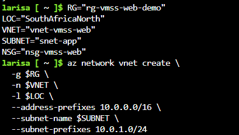
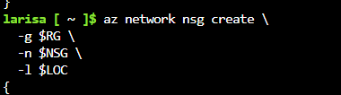
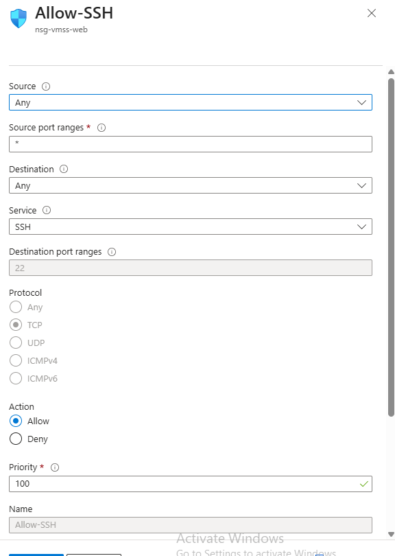
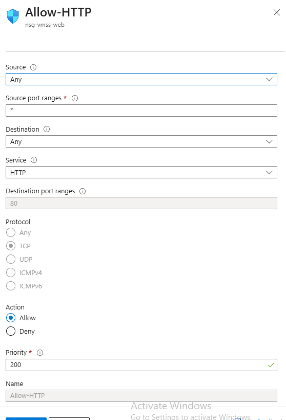
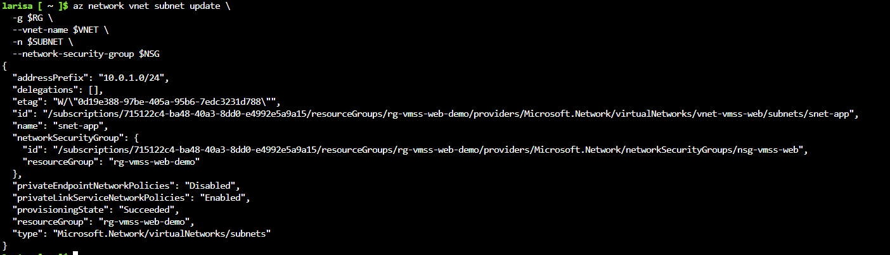
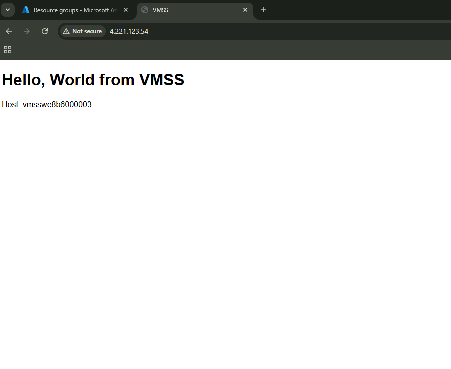
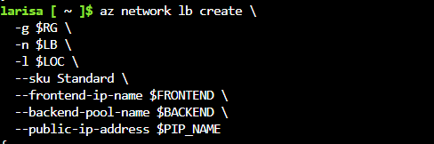
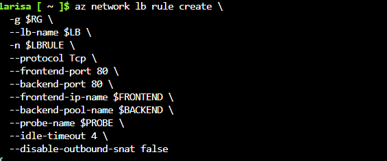
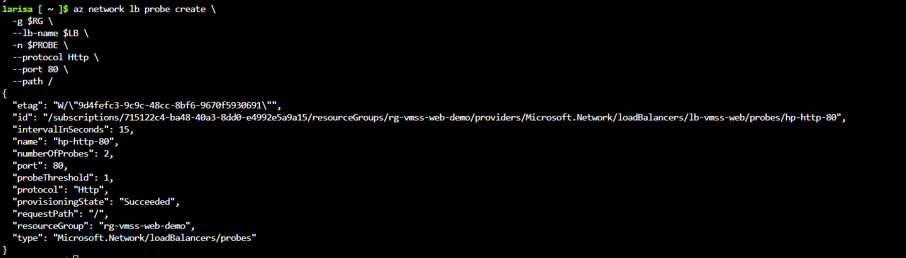

# VMSS + Load Balancer + Health Probe Demo

Architecture overview
• 	Components: VM Scale Set (Ubuntu), Standard Load Balancer, Public IP (Standard), VNet/Subnet, NSG (HTTP/SSH), Health Probe, Autoscale.
• 	Flow: Internet → Public IP → Load Balancer (rule 80 + probe) → Backend pool (VMSS instances) → NGINX “Hello, World”.

This project demonstrates deploying an Azure Virtual Machine Scale Set (VMSS) behind a Standard Load Balancer with a TCP Health Probe for high availability and automatic traffic distribution.

## Step 1 — Create Resource Group

We start by creating a new Azure Resource Group to hold all the resources for this VMSS + Load Balancer + Health Probe demo.

**Azure CLI Command:**
[```bash
az group create -n $RG -l $LOC --tags env=demo owner=nhlanhla purpose=vmss-web'''](vmss-deploy-images/rg_create.png) 

**Verification in Azure Portal:**

After running the command, we can confirm the resource group was successfully created by viewing it in the Azure Portal’s **Resource groups** blade.  
The screenshot below shows the `rg-vmss-web-demo` resource group listed with its assigned location.


*Figure 1: Resource group successfully created and visible in the Azure Portal.*

## Step 2 — Create the Virtual Machine Scale Set (VMSS) with Cloud‑Init
In this step, we provision a Uniform Orchestration VM Scale Set running Ubuntu 22.04, attach it to our virtual network, and bootstrap it with a Cloud‑Init script that installs and configures Nginx.

**Cloud‑Init Script**
This script updates the package list, installs Nginx, deploys a simple HTML page, and ensures the service starts on boot.


  ### Step 3 — Networking & Security Configuration

In this step, we create the Virtual Network (VNet), Subnet, and Network Security Group (NSG), then configure inbound rules to allow SSH (22) and HTTP (80) traffic to our VM Scale Set.

### 3.1 Configuration of the Virtual Network & Subnet




### 3.2 Configuration of the Network Security Group (NSG)



### 3.3 Adding Inbound Rules for SSH and HTTP

**Allow SSH (Port 22)**  


**Allow HTTP (Port 80)**  



### 3.4 Associating the NSG with the Subnet



### 3.5 Verifying Page Load: Hello VMSS



### 4. Load Balancer Configuration

#### 4.1 Creating the Load Balancer  
Provisioned the Load Balancer to distribute traffic across VMSS instances.



#### 4.2 Configuring the HTTP Load Balancing Rule  
Define the rule that maps incoming HTTP traffic (port 80) to the backend pool.



#### 4.3 Creating and Associating the Health Probe  
Set up the health probe to monitor the availability of VMSS instances and ensure traffic is only routed to healthy nodes.



---

## ✅ Project Summary & Recruiter Impact

This demo showcases a complete deployment of a **Virtual Machine Scale Set (VMSS)** behind an **Azure Load Balancer** with a functioning **Health Probe**, secured via **Network Security Groups (NSGs)** and verified through live traffic routing to a custom "Hello VMSS" page.

What sets this project apart:

- 🔧 **End-to-End Architecture**: From virtual networking to traffic distribution, every layer is modular, secure, and scalable.
- 📸 **Visual Proof**: Each step includes annotated screenshots for recruiter clarity and technical verification.
- 📘 **Modular Documentation**: Designed for reuse, handoff, and clarity — ideal for Tier 1/2/3 support, onboarding, or demo replication.
- 🚀 **Real-World Readiness**: Reflects live troubleshooting, quota handling, and region constraints — not just theory.
- 🎯 **Recruiter-Facing Polish**: Every heading, image, and caption is crafted to showcase not just technical depth, but storytelling and clarity.

> 💡 *I design and document scalable Azure environments with precision — from virtual networking to load balancing and health probes. My strength lies in translating complex cloud architectures into clear, reusable frameworks that support both technical teams and recruiter visibility. If you're seeking an Azure Administrator or Engineer who can build, troubleshoot, and communicate with impact — I’m ready to contribute.*

---

## 🏅 Certifications

[](https://www.credly.com/badges)  
[](https://www.credly.com/badges)

> These certifications validate my foundational cloud knowledge and network troubleshooting expertise — both critical to architecting scalable, secure Azure environments like the VMSS + Load Balancer demo above.


