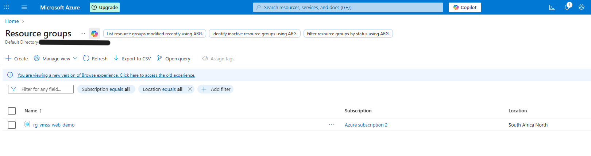
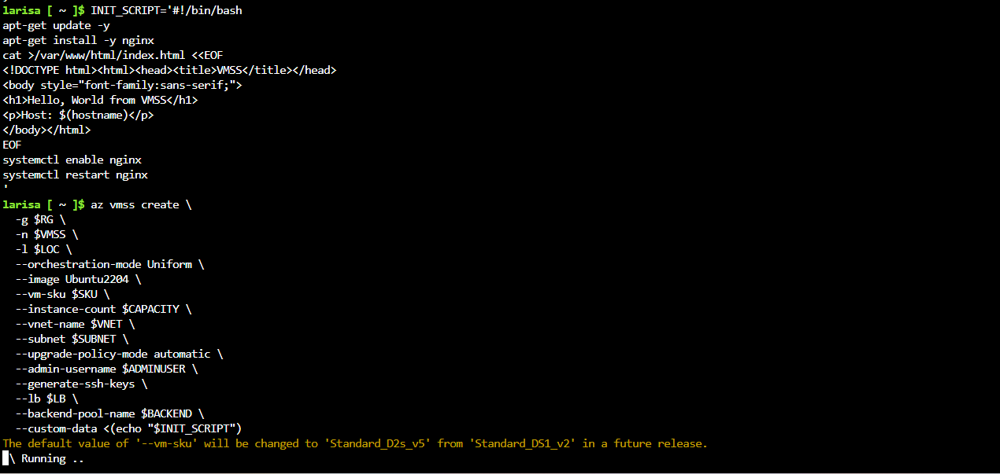

# VMSS + Load Balancer + Health Probe Demo

Architecture overview
• 	Components: VM Scale Set (Ubuntu), Standard Load Balancer, Public IP (Standard), VNet/Subnet, NSG (HTTP/SSH), Health Probe, Autoscale.
• 	Flow: Internet → Public IP → Load Balancer (rule 80 + probe) → Backend pool (VMSS instances) → NGINX “Hello, World”.

This project demonstrates deploying an Azure Virtual Machine Scale Set (VMSS) behind a Standard Load Balancer with a TCP Health Probe for high availability and automatic traffic distribution.

## Step 1 — Create Resource Group

We start by creating a new Azure Resource Group to hold all the resources for this VMSS + Load Balancer + Health Probe demo.

**Azure CLI Command:**
[```bash
az group create -n $RG -l $LOC --tags env=demo owner=nhlanhla purpose=vmss-web'''](vmss-deploy-images/rg_create.png) 

**Verification in Azure Portal:**

After running the command, we can confirm the resource group was successfully created by viewing it in the Azure Portal’s **Resource groups** blade.  
The screenshot below shows the `rg-vmss-web-demo` resource group listed with its assigned location.



*Figure 1: Resource group successfully created and visible in the Azure Portal.*

## Step 2 — Create the Virtual Machine Scale Set (VMSS) with Cloud‑Init
In this step, we provision a Uniform Orchestration VM Scale Set running Ubuntu 22.04, attach it to our virtual network, and bootstrap it with a Cloud‑Init script that installs and configures Nginx.

**Cloud‑Init Script**
This script updates the package list, installs Nginx, deploys a simple HTML page, and ensures the service starts on boot.

INIT_SCRIPT=$(cat <<'EOF'
#!/bin/bash
apt-get update -y
apt-get install -y nginx
cat > /var/www/html/index.html <<EOT
<!DOCTYPE html><html><head><title>WSS</title></head>
<body style="font-family:sans-serif;">
<h1>Hello, World from WSS!</h1>
</body></html>
EOT
systemctl enable nginx
systemctl restart nginx
EOF
)

az vmss create \
  -g $RG \
  -n $VMSS \
  --location $LOC \
  --orchestration-mode Uniform \
  --image Ubuntu2204 \
  --vm-sku $SKU \
  --instance-count $CAPACITY \
  --vnet-name $VNET \
  --subnet $SUBNET \
  --upgrade-policy-mode automatic \
  --admin-username $ADMINUSER \
  --generate-ssh-keys \
  --backend-pool-name $BACKEND \
  --custom-data <(echo "$INIT_SCRIPT")

  

